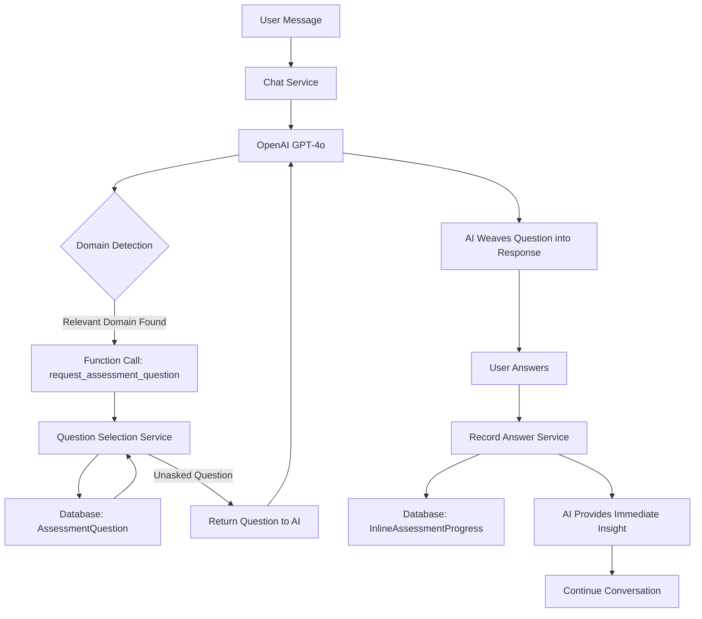
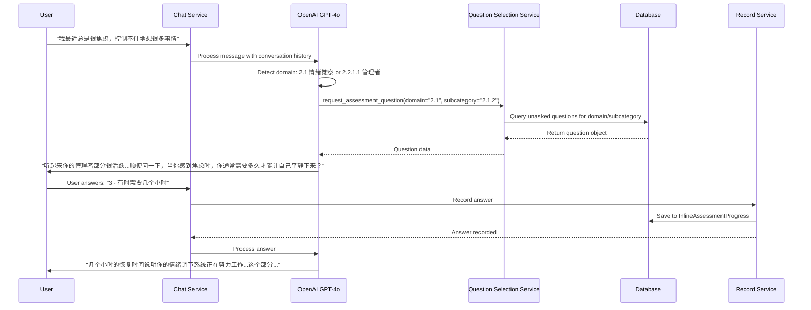
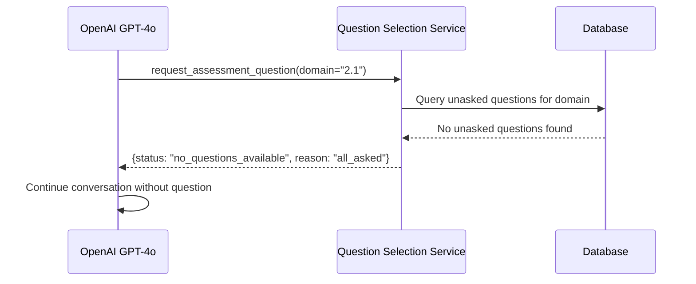

# Design Document: Inline Assessment Questions (内嵌式测评问题)

## Overview

在聊天过程中自然嵌入心理测评问题，通过AI检测对话中涉及的心理领域（五大domain及其子类别），动态请求相关问题，让用户在不知不觉中完成83题测评。这种方式解决了用户看到完整问卷就放弃的问题（"看见就不想做"），同时保持对话的自然流畅性。

The system embeds psychological assessment questions naturally into conversations. The AI detects which psychological domain (from 5 major domains and their subcategories) is relevant to the current conversation, requests appropriate questions via function calling, and weaves them seamlessly into the dialogue. This approach solves the problem of users abandoning the 83-question assessment when presented all at once.

## Architecture




## Sequence Diagrams

### Main Flow: Domain Detection and Question Injection



### Question Already Asked Flow




## Components and Interfaces

### Component 1: Domain Detection (AI-Driven)

**Purpose**: AI analyzes conversation context to identify relevant psychological domains and subcategories

**Interface**: Embedded in system prompt (no explicit API)

**Responsibilities**:
- Analyze user messages for psychological themes
- Map themes to domain codes (2.1-2.5 and subcategories)
- Decide when to request assessment questions
- Ensure questions feel natural in conversation flow

**Detection Logic**:
- 2.1 情绪觉察: Keywords like "焦虑", "情绪", "感受", "心情"
- 2.2 认知模式: Keywords like "想法", "思维", "总是觉得", "认为"
- 2.3 关系模式: Keywords like "关系", "朋友", "家人", "同事", "相处"
- 2.4 MBTI性格类型: Keywords like "性格", "喜欢", "习惯", "方式"
- 2.5 成长指数: Keywords like "成长", "改变", "学习", "进步"

### Component 2: Question Selection Service

**Purpose**: Select appropriate unasked questions based on domain/subcategory

**Interface**:
```python
class QuestionSelectionService:
    def get_question_for_domain(
        self,
        user_id: str,
        conversation_id: int,
        domain: str,
        subcategory: Optional[str] = None
    ) -> Dict[str, Any]:
        """
        Select an unasked question for the specified domain/subcategory.

        Returns:
            {
                "status": "success" | "no_questions_available",
                "question": {
                    "id": int,
                    "text": str,
                    "options": List[Dict],
                    "domain": str,
                    "subcategory": str
                } | None,
                "reason": str  # If no questions available
            }
        """
        pass
```

**Responsibilities**:
- Query AssessmentQuestion table filtered by domain/subcategory
- Exclude already-asked questions (check InlineAssessmentProgress)
- Return question in AI-friendly format
- Handle edge cases (no questions available, all asked)


### Component 3: Answer Recording Service

**Purpose**: Record user answers and update progress tracking

**Interface**:
```python
class AnswerRecordingService:
    def record_answer(
        self,
        user_id: str,
        conversation_id: int,
        question_id: int,
        answer_value: int,
        context: Optional[Dict] = None
    ) -> Dict[str, Any]:
        """
        Record user's answer to an inline assessment question.

        Returns:
            {
                "status": "success" | "error",
                "progress": {
                    "total_answered": int,
                    "total_questions": 83,
                    "completion_percentage": float,
                    "domains_covered": List[str]
                },
                "can_generate_report": bool
            }
        """
        pass
```

**Responsibilities**:
- Save answer to InlineAssessmentProgress table
- Update progress statistics
- Calculate domain coverage
- Determine if enough data exists for report generation
- Prevent duplicate answers for same question

### Component 4: Function Calling Tool Definition

**Purpose**: Define OpenAI function for requesting assessment questions

**Interface**:
```python
def get_inline_assessment_tool() -> Dict:
    return {
        "type": "function",
        "function": {
            "name": "request_assessment_question",
            "description": (
                "Call this function when the conversation touches on a psychological domain "
                "and you want to naturally embed an assessment question. Use this to gradually "
                "collect assessment data without making the user feel like they're taking a test."
            ),
            "parameters": {
                "type": "object",
                "properties": {
                    "domain": {
                        "type": "string",
                        "enum": ["2.1", "2.2", "2.3", "2.4", "2.5"],
                        "description": "Major psychological domain"
                    },
                    "subcategory": {
                        "type": "string",
                        "description": "Optional subcategory code (e.g., '2.1.1', '2.2.1.1')"
                    },
                    "reasoning": {
                        "type": "string",
                        "description": "Why this domain is relevant to current conversation"
                    }
                },
                "required": ["domain", "reasoning"]
            }
        }
    }
```


## Data Models

### Model 1: InlineAssessmentProgress

```python
class InlineAssessmentProgress(Base):
    """
    Tracks inline assessment progress and answers collected during conversations.
    Unlike UserQuestionnaireProgress (for formal 83-question assessment),
    this tracks questions asked naturally during chat.
    """
    __tablename__ = "inline_assessment_progress"

    id = Column(Integer, primary_key=True, autoincrement=True)
    user_id = Column(String(255), nullable=False, index=True)
    conversation_id = Column(Integer, ForeignKey('conversations.id'), nullable=False)

    # Question tracking
    question_id = Column(Integer, ForeignKey('assessment_questions.id'), nullable=False)
    answer_value = Column(Integer, nullable=False)  # 1-5 scale

    # Domain classification
    domain = Column(String(10), nullable=False, index=True)  # e.g., "2.1"
    subcategory = Column(String(20), nullable=True)  # e.g., "2.1.2"

    # Context
    asked_at = Column(DateTime, default=datetime.utcnow)
    answered_at = Column(DateTime, default=datetime.utcnow)
    conversation_context = Column(JSON, default={})  # Store relevant conversation snippet

    # Relationships
    question = relationship("AssessmentQuestion")
    conversation = relationship("Conversation")

    # Constraints
    __table_args__ = (
        UniqueConstraint('user_id', 'question_id', name='uq_user_question_inline'),
        Index('idx_user_domain', 'user_id', 'domain'),
    )
```

**Validation Rules**:
- user_id must be non-empty
- answer_value must be between 1 and 5
- domain must match pattern "2.[1-5]"
- question_id must reference existing AssessmentQuestion
- No duplicate (user_id, question_id) pairs

### Model 2: InlineAssessmentSummary

```python
class InlineAssessmentSummary(Base):
    """
    Aggregated summary of inline assessment progress per user.
    Updated after each answer to track overall progress.
    """
    __tablename__ = "inline_assessment_summary"

    id = Column(Integer, primary_key=True, autoincrement=True)
    user_id = Column(String(255), nullable=False, unique=True, index=True)

    # Progress metrics
    total_answered = Column(Integer, default=0)
    total_questions = Column(Integer, default=83)
    completion_percentage = Column(Float, default=0.0)

    # Domain coverage (JSON array of domain codes)
    domains_covered = Column(JSON, default=[])  # ["2.1", "2.2", ...]
    domain_question_counts = Column(JSON, default={})  # {"2.1": 5, "2.2": 3, ...}

    # Report generation
    can_generate_report = Column(Boolean, default=False)
    report_generated = Column(Boolean, default=False)
    report_id = Column(Integer, ForeignKey('psychology_reports.id'), nullable=True)

    # Timestamps
    started_at = Column(DateTime, default=datetime.utcnow)
    last_updated_at = Column(DateTime, default=datetime.utcnow, onupdate=datetime.utcnow)

    # Relationships
    report = relationship("PsychologyReport")
```

**Validation Rules**:
- total_answered <= total_questions
- completion_percentage = (total_answered / total_questions) * 100
- can_generate_report = True when total_answered >= 40 (minimum threshold)
- domains_covered must be valid domain codes


## Algorithmic Pseudocode

### Algorithm 1: Domain Detection and Question Request

```pascal
ALGORITHM detectDomainAndRequestQuestion(userMessage, conversationHistory)
INPUT: userMessage (String), conversationHistory (Array of Messages)
OUTPUT: questionData (Object) or null

BEGIN
  // Step 1: Analyze message for psychological themes
  themes ← analyzeThemes(userMessage, conversationHistory)

  // Step 2: Map themes to domains
  relevantDomains ← []
  FOR each theme IN themes DO
    domain ← mapThemeToDomain(theme)
    IF domain IS NOT NULL THEN
      relevantDomains.add(domain)
    END IF
  END FOR

  // Step 3: Check conversation pacing rules
  IF shouldAskQuestion(conversationHistory) = false THEN
    RETURN null
  END IF

  // Step 4: Select highest priority domain
  IF relevantDomains.isEmpty() THEN
    RETURN null
  END IF

  selectedDomain ← selectPriorityDomain(relevantDomains)

  // Step 5: Request question via function call
  questionData ← requestAssessmentQuestion(
    domain: selectedDomain.code,
    subcategory: selectedDomain.subcategory,
    reasoning: selectedDomain.reasoning
  )

  RETURN questionData
END
```

**Preconditions**:
- userMessage is non-empty string
- conversationHistory is valid array of message objects
- User session is authenticated

**Postconditions**:
- Returns question object if domain detected and question available
- Returns null if no domain detected or pacing rules prevent question
- No side effects on conversation state

**Loop Invariants**:
- All processed themes are valid psychological themes
- relevantDomains contains only valid domain codes


### Algorithm 2: Question Selection

```pascal
ALGORITHM selectQuestionForDomain(userId, conversationId, domain, subcategory)
INPUT: userId (String), conversationId (Integer), domain (String), subcategory (String or null)
OUTPUT: questionResult (Object)

BEGIN
  // Step 1: Query available questions
  IF subcategory IS NOT NULL THEN
    questions ← database.query(
      "SELECT * FROM assessment_questions
       WHERE (sub_section = ? OR category LIKE ?)
       AND questionnaire_id LIKE ?",
      [subcategory, subcategory + '%', 'questionnaire_' + domain + '%']
    )
  ELSE
    questions ← database.query(
      "SELECT * FROM assessment_questions
       WHERE questionnaire_id LIKE ?",
      ['questionnaire_' + domain + '%']
    )
  END IF

  // Step 2: Filter out already-asked questions
  askedQuestionIds ← database.query(
    "SELECT question_id FROM inline_assessment_progress
     WHERE user_id = ?",
    [userId]
  )

  availableQuestions ← []
  FOR each question IN questions DO
    IF question.id NOT IN askedQuestionIds THEN
      availableQuestions.add(question)
    END IF
  END FOR

  // Step 3: Handle no questions available
  IF availableQuestions.isEmpty() THEN
    RETURN {
      status: "no_questions_available",
      reason: "all_asked",
      question: null
    }
  END IF

  // Step 4: Select question (random or priority-based)
  selectedQuestion ← selectRandom(availableQuestions)

  // Step 5: Format for AI
  RETURN {
    status: "success",
    question: {
      id: selectedQuestion.id,
      text: selectedQuestion.text,
      options: selectedQuestion.options,
      domain: domain,
      subcategory: subcategory
    }
  }
END
```

**Preconditions**:
- userId is valid and non-empty
- conversationId exists in database
- domain matches pattern "2.[1-5]"
- Database connection is active

**Postconditions**:
- Returns success with question if available questions exist
- Returns no_questions_available if all questions asked
- Selected question is not in user's answered list
- No database state changes

**Loop Invariants**:
- All questions in availableQuestions are unasked by this user
- askedQuestionIds contains only valid question IDs


### Algorithm 3: Answer Recording and Progress Update

```pascal
ALGORITHM recordAnswerAndUpdateProgress(userId, conversationId, questionId, answerValue)
INPUT: userId (String), conversationId (Integer), questionId (Integer), answerValue (Integer)
OUTPUT: progressResult (Object)

BEGIN
  ASSERT answerValue >= 1 AND answerValue <= 5

  // Step 1: Check for duplicate answer
  existingAnswer ← database.query(
    "SELECT * FROM inline_assessment_progress
     WHERE user_id = ? AND question_id = ?",
    [userId, questionId]
  )

  IF existingAnswer IS NOT NULL THEN
    RETURN {
      status: "error",
      message: "Question already answered"
    }
  END IF

  // Step 2: Get question details for domain classification
  question ← database.query(
    "SELECT * FROM assessment_questions WHERE id = ?",
    [questionId]
  )

  domain ← extractDomain(question.questionnaire_id)
  subcategory ← question.sub_section OR question.category

  // Step 3: Record answer
  database.insert(
    "inline_assessment_progress",
    {
      user_id: userId,
      conversation_id: conversationId,
      question_id: questionId,
      answer_value: answerValue,
      domain: domain,
      subcategory: subcategory,
      asked_at: now(),
      answered_at: now()
    }
  )

  // Step 4: Update summary
  summary ← getOrCreateSummary(userId)
  summary.total_answered ← summary.total_answered + 1
  summary.completion_percentage ← (summary.total_answered / 83) * 100

  IF domain NOT IN summary.domains_covered THEN
    summary.domains_covered.add(domain)
  END IF

  summary.domain_question_counts[domain] ←
    (summary.domain_question_counts[domain] OR 0) + 1

  summary.can_generate_report ← (summary.total_answered >= 40)
  summary.last_updated_at ← now()

  database.update("inline_assessment_summary", summary)

  // Step 5: Return progress
  RETURN {
    status: "success",
    progress: {
      total_answered: summary.total_answered,
      total_questions: 83,
      completion_percentage: summary.completion_percentage,
      domains_covered: summary.domains_covered,
      can_generate_report: summary.can_generate_report
    }
  }
END
```

**Preconditions**:
- userId is valid and authenticated
- conversationId exists in conversations table
- questionId exists in assessment_questions table
- answerValue is integer between 1 and 5
- No existing answer for (userId, questionId) pair

**Postconditions**:
- New record created in inline_assessment_progress
- InlineAssessmentSummary updated with new totals
- completion_percentage accurately reflects progress
- can_generate_report flag set correctly based on threshold
- All database operations committed or rolled back atomically

**Loop Invariants**: N/A (no loops in main algorithm)


### Algorithm 4: Conversation Pacing Rules

```pascal
ALGORITHM shouldAskQuestion(conversationHistory)
INPUT: conversationHistory (Array of Messages)
OUTPUT: shouldAsk (Boolean)

BEGIN
  // Rule 1: Don't ask in first 2 rounds
  IF conversationHistory.length < 4 THEN  // 4 messages = 2 rounds (user + assistant)
    RETURN false
  END IF

  // Rule 2: Don't ask multiple questions in a row
  lastMessages ← conversationHistory.slice(-4)  // Last 2 rounds
  questionCount ← 0

  FOR each message IN lastMessages DO
    IF message.role = "assistant" AND containsAssessmentQuestion(message) THEN
      questionCount ← questionCount + 1
    END IF
  END FOR

  IF questionCount >= 1 THEN
    RETURN false
  END IF

  // Rule 3: Check if user is in acute distress (skip questions)
  lastUserMessage ← getLastUserMessage(conversationHistory)
  distressLevel ← analyzeDistressLevel(lastUserMessage)

  IF distressLevel = "high" OR distressLevel = "crisis" THEN
    RETURN false
  END IF

  // Rule 4: Probabilistic pacing (don't ask every turn)
  randomValue ← random(0, 1)
  IF randomValue < 0.3 THEN  // 30% chance to ask
    RETURN true
  ELSE
    RETURN false
  END IF
END
```

**Preconditions**:
- conversationHistory is valid array of message objects
- Each message has role and content fields

**Postconditions**:
- Returns boolean indicating whether to ask question
- No side effects on conversation state
- Respects all pacing rules

**Loop Invariants**:
- questionCount accurately reflects assessment questions in last 2 rounds
- All processed messages are valid message objects


## Key Functions with Formal Specifications

### Function 1: get_question_for_domain()

```python
def get_question_for_domain(
    db: Session,
    user_id: str,
    conversation_id: int,
    domain: str,
    subcategory: Optional[str] = None
) -> Dict[str, Any]:
    """
    Select an unasked assessment question for the specified domain.
    """
```

**Preconditions**:
- `db` is active SQLAlchemy session
- `user_id` is non-empty string
- `conversation_id` is positive integer referencing existing conversation
- `domain` matches pattern "2.[1-5]"
- `subcategory` is None or matches pattern "2.X.Y[.Z]"

**Postconditions**:
- Returns dict with status "success" or "no_questions_available"
- If success: question field contains valid question object
- If no_questions_available: question field is None
- No database modifications
- Query execution time < 100ms

**Loop Invariants**:
- All filtered questions belong to specified domain/subcategory
- No question in result set has been answered by user

### Function 2: record_answer()

```python
def record_answer(
    db: Session,
    user_id: str,
    conversation_id: int,
    question_id: int,
    answer_value: int,
    context: Optional[Dict] = None
) -> Dict[str, Any]:
    """
    Record user's answer and update progress tracking.
    """
```

**Preconditions**:
- `db` is active SQLAlchemy session with transaction support
- `user_id` is non-empty string
- `conversation_id` references existing conversation
- `question_id` references existing assessment question
- `answer_value` is integer in range [1, 5]
- No existing answer for (user_id, question_id) pair

**Postconditions**:
- New InlineAssessmentProgress record created
- InlineAssessmentSummary updated with incremented counts
- completion_percentage = (total_answered / 83) * 100
- can_generate_report = (total_answered >= 40)
- All database operations committed atomically
- Returns success status with updated progress metrics

**Loop Invariants**: N/A (no loops)


### Function 3: extract_domain_from_questionnaire_id()

```python
def extract_domain_from_questionnaire_id(questionnaire_id: str) -> str:
    """
    Extract domain code from questionnaire ID.
    Example: "questionnaire_2_1" -> "2.1"
    """
```

**Preconditions**:
- `questionnaire_id` is non-empty string
- `questionnaire_id` starts with "questionnaire_"

**Postconditions**:
- Returns domain code in format "2.X"
- Domain code matches pattern "2.[1-5]"
- No side effects

**Loop Invariants**: N/A (no loops)

### Function 4: should_ask_question()

```python
def should_ask_question(
    conversation_history: List[Dict],
    user_message: str
) -> bool:
    """
    Determine if it's appropriate to ask an assessment question.
    """
```

**Preconditions**:
- `conversation_history` is list of message dicts with 'role' and 'content' keys
- `user_message` is non-empty string

**Postconditions**:
- Returns boolean value
- Returns False if conversation length < 4 messages
- Returns False if question asked in last 2 rounds
- Returns False if user in acute distress
- Returns True/False probabilistically (30% chance) otherwise
- No side effects on conversation state

**Loop Invariants**:
- All processed messages in conversation_history are valid message objects
- Question count accurately reflects assessment questions in recent history


## Example Usage

### Example 1: Basic Flow - Emotional Awareness Domain

```python
# User message triggers domain detection
user_message = "我最近总是很焦虑，控制不住地想很多事情"

# AI detects domain 2.1 (情绪觉察) and calls function
question_result = get_question_for_domain(
    db=db_session,
    user_id="user_123",
    conversation_id=456,
    domain="2.1",
    subcategory="2.1.2"  # 情绪调节与恢复
)

# Result:
# {
#     "status": "success",
#     "question": {
#         "id": 15,
#         "text": "当你感到焦虑时，你通常需要多久才能让自己平静下来？",
#         "options": [
#             {"value": 1, "text": "很快，几分钟内"},
#             {"value": 2, "text": "大约半小时"},
#             {"value": 3, "text": "有时需要几个小时"},
#             {"value": 4, "text": "通常需要一整天"},
#             {"value": 5, "text": "很难平静下来"}
#         ],
#         "domain": "2.1",
#         "subcategory": "2.1.2"
#     }
# }

# AI weaves question into response
ai_response = """
听起来你的管理者部分很活跃——它在不断说'必须控制住，不能让事情失控'。
这种持续的焦虑往往是内心的保护机制在工作。

顺便问一下，当你感到焦虑时，你通常需要多久才能让自己平静下来？
1. 很快，几分钟内
2. 大约半小时
3. 有时需要几个小时
4. 通常需要一整天
5. 很难平静下来
"""

# User answers
user_answer = "3"

# Record answer
progress = record_answer(
    db=db_session,
    user_id="user_123",
    conversation_id=456,
    question_id=15,
    answer_value=3
)

# Result:
# {
#     "status": "success",
#     "progress": {
#         "total_answered": 8,
#         "total_questions": 83,
#         "completion_percentage": 9.64,
#         "domains_covered": ["2.1", "2.2"],
#         "can_generate_report": False
#     }
# }

# AI provides immediate insight
ai_insight = """
几个小时的恢复时间说明你的情绪调节系统正在努力工作，但可能需要一些支持。
这不是弱点——这是你的系统在告诉你，它需要更多的工具来处理这些强烈的感受。
"""
```


### Example 2: No Questions Available

```python
# AI detects domain but all questions already asked
question_result = get_question_for_domain(
    db=db_session,
    user_id="user_123",
    conversation_id=456,
    domain="2.1"
)

# Result:
# {
#     "status": "no_questions_available",
#     "reason": "all_asked",
#     "question": None
# }

# AI continues conversation without question
ai_response = """
听起来你的情绪调节能力正在发展中。我们之前聊过的那些策略，
你有机会尝试吗？
"""
```

### Example 3: Pacing Rules Prevent Question

```python
# Check if should ask question
conversation_history = [
    {"role": "user", "content": "我很焦虑"},
    {"role": "assistant", "content": "...你通常需要多久平静下来？"},  # Question asked
    {"role": "user", "content": "3"},
    {"role": "assistant", "content": "..."},
    {"role": "user", "content": "我还是很担心"}
]

should_ask = should_ask_question(conversation_history, "我还是很担心")
# Returns: False (question asked in last 2 rounds)

# AI continues without asking new question
```

### Example 4: Complete Workflow with Report Generation

```python
# After 40+ questions answered
progress = record_answer(
    db=db_session,
    user_id="user_123",
    conversation_id=456,
    question_id=67,
    answer_value=4
)

# Result:
# {
#     "status": "success",
#     "progress": {
#         "total_answered": 42,
#         "total_questions": 83,
#         "completion_percentage": 50.6,
#         "domains_covered": ["2.1", "2.2", "2.3", "2.4", "2.5"],
#         "can_generate_report": True  # Threshold reached!
#     }
# }

# AI notifies user
ai_notification = """
我注意到，通过我们这段时间的对话，我已经对你的内在世界有了比较全面的了解。
如果你愿意，我可以为你生成一份心理洞察报告，帮你系统地看清自己的心理能量分布。
"""
```


## Correctness Properties

*A property is a characteristic or behavior that should hold true across all valid executions of a system—essentially, a formal statement about what the system should do. Properties serve as the bridge between human-readable specifications and machine-verifiable correctness guarantees.*

### Property 1: Domain validation rejects invalid codes

*For any* string that is not in the set {"2.1", "2.2", "2.3", "2.4", "2.5"}, the Question_Selection_Service SHALL reject it as an invalid domain, and for any string in that set, it SHALL accept it.

**Validates: Requirements 1.2, 8.2, 11.1**

### Property 2: Question selection returns only matching domain questions

*For any* valid domain and optional subcategory, all questions returned by the Question_Selection_Service SHALL belong to the requested domain, and when a subcategory is specified, SHALL also belong to that subcategory.

**Validates: Requirements 2.1, 2.2, 2.4**

### Property 3: Question selection excludes already-answered questions

*For any* user with a set of already-answered questions, the question returned by the Question_Selection_Service SHALL not be in that answered set.

**Validates: Requirements 2.3**

### Property 4: No duplicate answers per user-question pair

*For any* user and question, recording an answer when one already exists for that (user_id, question_id) pair SHALL be rejected, and the count of InlineAssessmentProgress records for that pair SHALL never exceed 1.

**Validates: Requirements 4.3, 8.1**

### Property 5: Answer value range enforcement

*For any* integer value, the Answer_Recording_Service SHALL accept it if and only if it is between 1 and 5 inclusive. All values outside this range or non-integer values SHALL be rejected.

**Validates: Requirements 4.2, 8.3, 11.2**

### Property 6: Progress summary consistency

*For any* user, after any sequence of answer recordings, the InlineAssessmentSummary SHALL satisfy all of: total_answered equals the count of InlineAssessmentProgress records for that user, completion_percentage equals (total_answered / 83) * 100, domains_covered equals the unique set of domain values in InlineAssessmentProgress for that user, and domain_question_counts[d] equals the count of answers with domain d.

**Validates: Requirements 5.1, 5.2, 5.3, 5.4, 5.5**

### Property 7: Report generation threshold biconditional

*For any* InlineAssessmentSummary, can_generate_report SHALL be true if and only if total_answered >= 40.

**Validates: Requirements 6.1, 6.2**

### Property 8: Atomic answer recording

*For any* answer recording operation, either both the InlineAssessmentProgress insert and the InlineAssessmentSummary update succeed, or neither persists.

**Validates: Requirements 4.4, 4.5**

### Property 9: Conversation pacing prevents early and consecutive questions

*For any* conversation history with fewer than 4 messages, should_ask_question SHALL return false. *For any* conversation history where an assessment question was asked in the last 2 rounds, should_ask_question SHALL return false.

**Validates: Requirements 7.1, 7.2**

### Property 10: Domain extraction round-trip

*For any* valid domain code "X.Y" where X.Y is in {"2.1", "2.2", "2.3", "2.4", "2.5"}, constructing a questionnaire_id as "questionnaire_X_Y" and then extracting the domain SHALL produce the original domain code "X.Y".

**Validates: Requirements 9.1, 9.2**

### Property 11: User data access isolation

*For any* two distinct users A and B, user A requesting assessment data SHALL only receive data belonging to user A, never data belonging to user B.

**Validates: Requirements 11.3**


## Error Handling

### Error Scenario 1: Duplicate Answer Attempt

**Condition**: User tries to answer the same question twice (e.g., AI asks same question in different conversation)

**Response**:
- Check for existing answer before recording
- Return error status with message "Question already answered"
- Do not create duplicate record
- Do not update summary statistics

**Recovery**:
- AI continues conversation without recording answer
- AI may acknowledge: "我记得你之前回答过类似的问题了，我们继续聊别的"

### Error Scenario 2: Invalid Answer Value

**Condition**: Answer value outside 1-5 range or non-numeric

**Response**:
- Validate answer_value before database insertion
- Raise ValueError with descriptive message
- Rollback transaction
- Return error status to caller

**Recovery**:
- AI prompts user to select valid option
- Example: "请从1-5中选择一个数字"

### Error Scenario 3: No Questions Available for Domain

**Condition**: All questions in domain already asked by user

**Response**:
- Return status "no_questions_available" with reason "all_asked"
- Do not attempt to ask question
- Log event for analytics

**Recovery**:
- AI continues conversation naturally without question
- AI may explore related domains that still have questions

### Error Scenario 4: Database Connection Failure

**Condition**: Database unavailable during question selection or answer recording

**Response**:
- Catch database connection exceptions
- Return error status with technical details
- Do not crash conversation flow
- Log error with full stack trace

**Recovery**:
- AI continues conversation without assessment functionality
- System retries database connection on next operation
- User experience not interrupted

### Error Scenario 5: Question ID Not Found

**Condition**: AI requests question with non-existent ID

**Response**:
- Validate question_id exists before recording answer
- Return error status "question_not_found"
- Do not create orphaned progress records

**Recovery**:
- Log error for investigation
- AI continues conversation
- System may need to refresh question cache


### Error Scenario 6: Conversation Context Missing

**Condition**: conversation_id does not exist in database

**Response**:
- Validate conversation_id before recording answer
- Return error status "conversation_not_found"
- Do not create orphaned progress records

**Recovery**:
- Log error with user_id and conversation_id for investigation
- AI may need to create new conversation context
- Graceful degradation: continue conversation without recording

## Testing Strategy

### Unit Testing Approach

**Test Coverage Goals**: 90%+ code coverage for core functions

**Key Test Cases**:

1. **Question Selection Tests**
   - Test selecting question from specific domain
   - Test selecting question from subcategory
   - Test filtering out already-asked questions
   - Test handling no available questions
   - Test random selection from multiple available questions

2. **Answer Recording Tests**
   - Test successful answer recording
   - Test duplicate answer prevention
   - Test invalid answer value rejection
   - Test summary update after answer
   - Test atomic transaction rollback on error

3. **Domain Extraction Tests**
   - Test extracting domain from various questionnaire_id formats
   - Test handling malformed questionnaire_id
   - Test domain code validation

4. **Pacing Rules Tests**
   - Test early conversation prevention (< 2 rounds)
   - Test recent question prevention
   - Test distress level detection
   - Test probabilistic pacing

**Test Framework**: pytest with SQLAlchemy test fixtures

**Example Test**:
```python
def test_record_answer_updates_summary(db_session, test_user):
    # Arrange
    user_id = test_user.id
    question_id = 1

    # Act
    result = record_answer(
        db=db_session,
        user_id=user_id,
        conversation_id=1,
        question_id=question_id,
        answer_value=3
    )

    # Assert
    assert result["status"] == "success"
    assert result["progress"]["total_answered"] == 1
    assert result["progress"]["completion_percentage"] == 1.2  # 1/83 * 100
```


### Property-Based Testing Approach

**Property Test Library**: Hypothesis (Python)

**Properties to Test**:

1. **Answer Value Range Property**
   - Generate random answer values
   - Verify all valid values (1-5) are accepted
   - Verify all invalid values are rejected

2. **Progress Consistency Property**
   - Generate random sequences of answer recordings
   - Verify total_answered always equals actual count
   - Verify completion_percentage calculation is accurate

3. **No Duplicate Answers Property**
   - Generate random sequences of answer attempts
   - Verify duplicate (user_id, question_id) pairs are rejected
   - Verify first answer is preserved

4. **Domain Coverage Property**
   - Generate random answer sequences across domains
   - Verify domains_covered matches unique domains in answers
   - Verify domain_question_counts are accurate

**Example Property Test**:
```python
from hypothesis import given, strategies as st

@given(
    answer_value=st.integers(min_value=1, max_value=5),
    user_id=st.text(min_size=1, max_size=50),
    question_id=st.integers(min_value=1, max_value=1000)
)
def test_valid_answer_values_accepted(db_session, answer_value, user_id, question_id):
    """Property: All answer values in range [1,5] should be accepted"""
    result = record_answer(
        db=db_session,
        user_id=user_id,
        conversation_id=1,
        question_id=question_id,
        answer_value=answer_value
    )
    assert result["status"] == "success"
```

### Integration Testing Approach

**Test Scenarios**:

1. **End-to-End Conversation Flow**
   - Simulate multi-turn conversation
   - Verify domain detection triggers question request
   - Verify question selection returns unasked question
   - Verify answer recording updates progress
   - Verify AI receives updated progress for next turn

2. **Database Transaction Integrity**
   - Test concurrent answer recordings
   - Verify no race conditions in summary updates
   - Verify atomic commits/rollbacks

3. **OpenAI Function Calling Integration**
   - Test function call from AI to question selection
   - Test function response format compatibility
   - Verify AI can parse and use question data

**Test Environment**: Isolated test database with seeded questions

**Example Integration Test**:
```python
def test_complete_inline_assessment_flow(client, db_session, test_user):
    # Round 1: User expresses anxiety
    response = client.post("/api/chat", json={
        "message": "我最近很焦虑",
        "user_id": test_user.id
    })

    # Verify AI detected domain and asked question
    assert "question" in response.json()
    question_id = response.json()["question"]["id"]

    # Round 2: User answers
    response = client.post("/api/chat", json={
        "message": "3",
        "user_id": test_user.id,
        "question_id": question_id
    })

    # Verify answer recorded and progress updated
    summary = db_session.query(InlineAssessmentSummary).filter_by(
        user_id=test_user.id
    ).first()
    assert summary.total_answered == 1
    assert "2.1" in summary.domains_covered
```


## Performance Considerations

### Database Query Optimization

**Challenge**: Question selection requires filtering by domain and excluding asked questions

**Solution**:
- Create composite index on (user_id, question_id) in InlineAssessmentProgress
- Create index on domain field for fast filtering
- Use EXISTS subquery instead of JOIN for better performance
- Cache asked question IDs in Redis for frequent users

**Expected Performance**:
- Question selection query: < 50ms
- Answer recording transaction: < 100ms
- Summary update: < 50ms

### Caching Strategy

**User Progress Cache**:
- Cache InlineAssessmentSummary in Redis with 5-minute TTL
- Invalidate cache on answer recording
- Reduces database reads for progress checks

**Question Pool Cache**:
- Cache available questions per domain in Redis
- Update cache when questions are answered
- Reduces repeated database queries

**Implementation**:
```python
# Cache key pattern
cache_key = f"inline_assessment:user:{user_id}:summary"
cache_ttl = 300  # 5 minutes

# Check cache before database
cached_summary = redis_client.get(cache_key)
if cached_summary:
    return json.loads(cached_summary)

# Query database and cache result
summary = db.query(InlineAssessmentSummary).filter_by(user_id=user_id).first()
redis_client.setex(cache_key, cache_ttl, json.dumps(summary.to_dict()))
```

### Scalability Considerations

**Concurrent Users**: System should handle 1000+ concurrent conversations

**Database Connection Pooling**:
- Use SQLAlchemy connection pool (size: 20, max_overflow: 10)
- Set reasonable connection timeout (30s)

**Async Processing**:
- Answer recording can be async (non-blocking for AI response)
- Use background task queue (Celery) for summary updates if needed

**Monitoring**:
- Track question selection latency
- Monitor database connection pool usage
- Alert on slow queries (> 200ms)


## Security Considerations

### Data Privacy

**User Answer Protection**:
- Answers contain sensitive psychological data
- Encrypt answers at rest using database-level encryption
- Restrict access to answers via user_id authentication
- Never expose raw answers in API responses without authentication

**Access Control**:
- Users can only access their own answers and progress
- Admin access requires separate authentication
- Audit log for all answer access

### Input Validation

**Answer Value Validation**:
- Strictly validate answer_value in range [1, 5]
- Reject non-integer values
- Prevent SQL injection via parameterized queries

**User ID Validation**:
- Validate user_id format and existence
- Prevent user impersonation
- Use session-based authentication

**Domain Code Validation**:
- Whitelist valid domain codes: ["2.1", "2.2", "2.3", "2.4", "2.5"]
- Reject malformed domain codes
- Prevent injection attacks

### Rate Limiting

**Answer Recording Rate Limit**:
- Maximum 10 answers per minute per user
- Prevents abuse and spam
- Returns 429 Too Many Requests if exceeded

**Question Request Rate Limit**:
- Maximum 20 question requests per minute per user
- Prevents excessive database queries

### GDPR Compliance

**Right to Access**:
- Users can export all their answers
- Provide API endpoint: GET /api/inline-assessment/export

**Right to Deletion**:
- Users can delete all their assessment data
- Cascade delete: InlineAssessmentProgress + InlineAssessmentSummary
- Provide API endpoint: DELETE /api/inline-assessment/data

**Data Retention**:
- Keep answers for 2 years by default
- Automatically delete after retention period
- Allow users to opt-out of data retention


## Dependencies

### Backend Dependencies

**Python Packages**:
- `sqlalchemy>=2.0.0` - ORM for database operations
- `fastapi>=0.104.0` - API framework
- `openai>=1.0.0` - OpenAI API client for GPT-4o
- `pydantic>=2.0.0` - Data validation
- `redis>=5.0.0` - Caching layer
- `pytest>=7.4.0` - Testing framework
- `hypothesis>=6.92.0` - Property-based testing

**Database**:
- PostgreSQL 14+ - Primary database
- Redis 7+ - Caching and session storage

### External Services

**OpenAI API**:
- Model: GPT-4o
- Function calling capability required
- API key with sufficient quota

### Existing System Integration

**Models to Extend**:
- `AssessmentQuestion` - Existing model, no changes needed
- `Conversation` - Existing model, no changes needed
- `PsychologyReport` - May need to support inline assessment data source

**Services to Integrate**:
- `chat_service.py` - Add function calling handler for request_assessment_question
- `psychology_report_routes.py` - Add endpoint to generate report from inline data
- `tools.py` - Add inline assessment tool definition

**Database Migrations**:
- Create `inline_assessment_progress` table
- Create `inline_assessment_summary` table
- Add indexes for performance

### Frontend Dependencies (Next.js)

**Components to Create**:
- `InlineQuestionDisplay` - Render assessment questions in chat
- `ProgressIndicator` - Show completion progress subtly
- `ReportReadyNotification` - Notify when report can be generated

**State Management**:
- Track current inline assessment state
- Handle question display and answer submission
- Update progress indicator


## System Prompt Integration

### Prompt Addition for Domain Detection

Add to existing system prompt in `system_prompts.py`:

```python
INLINE_ASSESSMENT_INSTRUCTIONS = """
<inline_assessment>
你现在具备一个新的能力：在对话中自然地嵌入心理测评问题。

规则：
1. 当对话触及某个心理领域（情绪觉察、认知模式、关系模式、性格类型、成长指数）时，
   你可以调用 request_assessment_question 函数来获取一个相关问题。

2. 将问题自然地融入对话，不要让用户感觉"我在被测试"。
   - ✓ 好的方式："顺便问一下，当你感到焦虑时..."
   - ✓ 好的方式："我好奇，在这种情况下你通常..."
   - ✗ 不好的方式："现在我要问你一个测评问题"

3. 用户回答后，立即给出基于答案的洞察，然后继续对话。
   不要说"谢谢你的回答"这种客套话。

4. 节奏控制：
   - 前2轮对话不要问测评问题
   - 不要连续两轮都问问题
   - 如果用户处于强烈情绪中，不要问问题
   - 大约每3-5轮对话问一个问题

5. 如果函数返回 no_questions_available，说明该领域的问题都问过了，
   继续对话即可，不要提及这个技术细节。

五大领域：
- 2.1 情绪觉察 (Emotional Awareness)
- 2.2 认知模式 (Cognitive Patterns)
- 2.3 关系模式 (Relational Patterns)
- 2.4 MBTI性格类型 (MBTI Personality)
- 2.5 成长指数 (Growth Potential)

每个领域都有子类别，如果能识别出子类别，在调用函数时传入 subcategory 参数。
</inline_assessment>
"""
```

### Function Calling Tool Registration

Update `tools.py`:

```python
def get_openai_tools() -> List[Dict]:
    """Return all OpenAI function-calling tool definitions."""
    return [
        # Existing tool
        {
            "type": "function",
            "function": {
                "name": "recommend_module",
                # ... existing definition
            }
        },
        # New tool
        {
            "type": "function",
            "function": {
                "name": "request_assessment_question",
                "description": (
                    "Call this when conversation touches a psychological domain "
                    "and you want to naturally embed an assessment question."
                ),
                "parameters": {
                    "type": "object",
                    "properties": {
                        "domain": {
                            "type": "string",
                            "enum": ["2.1", "2.2", "2.3", "2.4", "2.5"]
                        },
                        "subcategory": {
                            "type": "string",
                            "description": "Optional subcategory (e.g., '2.1.2')"
                        },
                        "reasoning": {
                            "type": "string",
                            "description": "Why this domain is relevant"
                        }
                    },
                    "required": ["domain", "reasoning"]
                }
            }
        }
    ]
```


## Implementation Phases

### Phase 1: Core Infrastructure (Week 1)

**Database Models**:
- Create InlineAssessmentProgress model
- Create InlineAssessmentSummary model
- Write and test database migrations
- Add indexes for performance

**Basic Services**:
- Implement QuestionSelectionService.get_question_for_domain()
- Implement AnswerRecordingService.record_answer()
- Implement domain extraction utilities
- Write unit tests (target: 90% coverage)

### Phase 2: AI Integration (Week 2)

**Function Calling**:
- Add request_assessment_question tool definition
- Update system prompt with inline assessment instructions
- Implement function call handler in chat_service.py
- Test AI domain detection and question requesting

**Answer Processing**:
- Implement answer extraction from user messages
- Implement immediate insight generation
- Test end-to-end conversation flow

### Phase 3: Pacing and UX (Week 3)

**Pacing Rules**:
- Implement should_ask_question() logic
- Add distress level detection
- Add probabilistic pacing
- Test pacing rules with various conversation patterns

**Progress Tracking**:
- Implement progress summary updates
- Add report generation threshold detection
- Create API endpoint for progress retrieval
- Test progress consistency

### Phase 4: Frontend Integration (Week 4)

**UI Components**:
- Create InlineQuestionDisplay component
- Add subtle progress indicator
- Implement report-ready notification
- Style questions to match conversation flow

**State Management**:
- Track inline assessment state in frontend
- Handle question display and answer submission
- Update UI based on progress

### Phase 5: Testing and Optimization (Week 5)

**Testing**:
- Property-based testing with Hypothesis
- Integration testing with test database
- Load testing for concurrent users
- User acceptance testing

**Optimization**:
- Implement Redis caching
- Optimize database queries
- Add monitoring and logging
- Performance tuning

### Phase 6: Deployment and Monitoring (Week 6)

**Deployment**:
- Deploy database migrations to production
- Deploy backend services
- Deploy frontend updates
- Gradual rollout (10% → 50% → 100%)

**Monitoring**:
- Set up metrics dashboards
- Configure alerts for errors
- Monitor question selection latency
- Track user engagement metrics


## Success Metrics

### User Engagement Metrics

**Primary Metrics**:
- **Completion Rate**: % of users who answer ≥40 questions (target: 60%)
- **Questions per Conversation**: Average questions answered per session (target: 3-5)
- **Time to 40 Questions**: Days to reach report threshold (target: < 14 days)

**Secondary Metrics**:
- **Question Answer Rate**: % of asked questions that get answered (target: 85%)
- **Conversation Continuation**: % of users who continue after answering (target: 90%)
- **Report Generation Rate**: % of eligible users who generate reports (target: 70%)

### Technical Performance Metrics

**Latency**:
- Question selection: < 50ms (p95)
- Answer recording: < 100ms (p95)
- End-to-end function call: < 200ms (p95)

**Reliability**:
- Success rate: > 99.5%
- Error rate: < 0.5%
- Database transaction success: > 99.9%

### User Experience Metrics

**Naturalness**:
- User feedback: "Questions felt natural" (target: > 80% positive)
- Drop-off rate after question: < 5%
- Complaints about "feeling tested": < 2%

**Value Perception**:
- Users who find insights helpful: > 85%
- Users who complete after reaching threshold: > 70%
- NPS score for inline assessment: > 50

## Monitoring and Alerting

### Key Metrics to Monitor

1. **Question Selection Failures**: Alert if > 1% failure rate
2. **Answer Recording Errors**: Alert if > 0.5% error rate
3. **Database Query Latency**: Alert if p95 > 200ms
4. **Cache Hit Rate**: Alert if < 80%
5. **Duplicate Answer Attempts**: Monitor for bugs

### Logging Strategy

**Log Levels**:
- INFO: Question requested, answer recorded, progress updated
- WARNING: No questions available, pacing rules prevented question
- ERROR: Database errors, validation failures, unexpected exceptions

**Log Format**:
```json
{
  "timestamp": "2024-01-15T10:30:00Z",
  "level": "INFO",
  "event": "question_requested",
  "user_id": "user_123",
  "conversation_id": 456,
  "domain": "2.1",
  "subcategory": "2.1.2",
  "question_id": 15,
  "latency_ms": 45
}
```

### Dashboard Metrics

**Real-time Dashboard**:
- Questions asked per hour
- Answers recorded per hour
- Average completion percentage
- Domain distribution
- Error rate trends

**Weekly Report**:
- Total users engaged with inline assessment
- Average questions per user
- Completion rate trends
- Most/least covered domains
- User feedback summary

