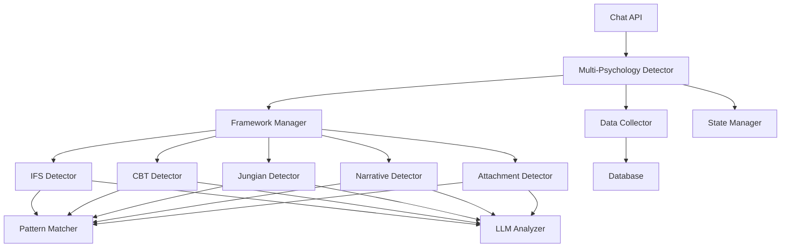
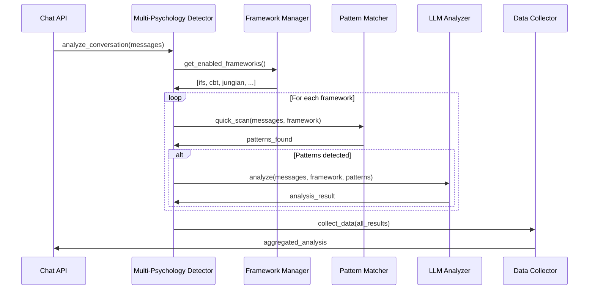

# Design Document

## Overview

This design extends the existing IFS detection system to support comprehensive multi-framework psychological analysis. The system will maintain the proven two-stage hybrid approach (fast pattern matching + LLM validation) while scaling to support 5 psychological frameworks simultaneously. The architecture emphasizes modularity, performance, and maintainability.

## Architecture

### High-Level Architecture



### Framework Detection Flow



## Components and Interfaces

### 1. Multi-Psychology Detector (Core Orchestrator)

**Purpose**: Main entry point that coordinates analysis across all enabled frameworks.

**Key Methods**:
```python
class MultiPsychologyDetector:
    def analyze_conversation(self, messages: List[Dict], existing_state: Optional[Dict] = None) -> Dict
    def should_analyze(self, message_count: int, framework: str) -> bool
    def get_framework_analysis(self, framework: str, messages: List[Dict]) -> Dict
```

**Responsibilities**:
- Coordinate analysis across multiple frameworks
- Manage framework-specific configurations
- Aggregate results from individual detectors
- Handle errors gracefully per framework

### 2. Framework Manager

**Purpose**: Manages framework registration, configuration, and lifecycle.

**Key Methods**:
```python
class FrameworkManager:
    def register_framework(self, framework: BaseFrameworkDetector) -> None
    def get_enabled_frameworks(self) -> List[str]
    def get_framework_config(self, framework_name: str) -> Dict
    def is_framework_enabled(self, framework_name: str) -> bool
```

**Configuration Structure**:
```python
FRAMEWORK_CONFIG = {
    'ifs': {
        'enabled': True,
        'analysis_interval': 3,
        'confidence_threshold': 0.6,
        'window_size': 10
    },
    'cbt': {
        'enabled': True,
        'analysis_interval': 2,
        'confidence_threshold': 0.7,
        'window_size': 8
    },
    # ... other frameworks
}
```

### 3. Base Framework Detector (Abstract)

**Purpose**: Common interface for all psychology framework detectors.

```python
class BaseFrameworkDetector(ABC):
    @abstractmethod
    def get_patterns(self) -> Dict[str, Dict[str, List[str]]]
    
    @abstractmethod
    def analyze_with_llm(self, messages: List[Dict], patterns: Dict) -> Dict
    
    @abstractmethod
    def get_framework_name(self) -> str
    
    def quick_scan(self, messages: List[Dict]) -> Dict:
        # Common pattern matching logic
        pass
```

### 4. Framework-Specific Detectors

#### CBT Detector
**Detects**: Cognitive distortions, behavioral patterns, thought records, homework assignments

**Pattern Categories**:
- Cognitive distortions (catastrophizing, black-and-white thinking, mind reading)
- Behavioral activation/avoidance patterns
- Thought-feeling-behavior connections
- CBT techniques and interventions

#### Jungian Detector
**Detects**: Archetypal content, shadow work, individuation, dream analysis

**Pattern Categories**:
- Archetypal references (shadow, anima/animus, persona, Self)
- Dream content and symbolism
- Individuation process indicators
- Psychological complexes and projections

#### Narrative Detector
**Detects**: Problem externalization, re-authoring, unique outcomes

**Pattern Categories**:
- Externalization language
- Alternative story development
- Preferred identity claims
- Deconstruction of dominant narratives

#### Attachment Detector
**Detects**: Attachment styles, relational patterns, emotional regulation

**Pattern Categories**:
- Attachment behaviors (secure, anxious, avoidant, disorganized)
- Relationship dynamics and strategies
- Emotional regulation patterns
- Attachment needs and fears

### 5. Enhanced Pattern Matcher

**Purpose**: Extended to support multiple frameworks with optimized performance.

```python
class EnhancedPatternMatcher:
    def __init__(self):
        self.framework_patterns = self._load_all_patterns()
        self.compiled_patterns = self._compile_patterns()
    
    def quick_scan_all_frameworks(self, messages: List[Dict]) -> Dict[str, Dict]
    def quick_scan_framework(self, messages: List[Dict], framework: str) -> Dict
```

**Performance Optimizations**:
- Single pass through messages for all frameworks
- Compiled regex patterns for faster matching
- Framework-specific pattern caching
- Language detection optimization

### 6. Enhanced LLM Analyzer

**Purpose**: Framework-aware LLM analysis with optimized prompts.

```python
class EnhancedLLMAnalyzer:
    def analyze_framework(self, messages: List[Dict], framework: str, patterns: Dict) -> Dict
    def analyze_multiple_frameworks(self, messages: List[Dict], frameworks_patterns: Dict) -> Dict
```

**Framework-Specific Prompts**:
- Each framework has specialized analysis prompts
- Bilingual prompt support (English/Chinese)
- Focused analysis based on detected patterns
- Structured JSON output for each framework

### 7. Data Collector

**Purpose**: Comprehensive data collection and aggregation across frameworks.

```python
class DataCollector:
    def collect_framework_data(self, framework: str, analysis: Dict, conversation_id: int) -> None
    def aggregate_conversation_data(self, conversation_id: int) -> Dict
    def export_research_data(self, filters: Dict) -> Dict
```

**Data Structure**:
```python
{
    'conversation_id': int,
    'message_id': int,
    'timestamp': str,
    'frameworks': {
        'ifs': {...},
        'cbt': {...},
        'jungian': {...},
        'narrative': {...},
        'attachment': {...}
    },
    'cross_framework_insights': {...},
    'aggregated_metrics': {...}
}
```

## Data Models

### Framework Analysis Result
```python
class FrameworkAnalysis(BaseModel):
    framework_name: str
    analyzed: bool = True
    llm_used: bool = False
    analysis_type: str = "hybrid"
    confidence_score: float = Field(ge=0.0, le=1.0)
    elements_detected: List[Dict] = Field(default_factory=list)
    patterns_found: Dict = Field(default_factory=dict)
    evidence: Optional[str] = None
    timestamp: Optional[datetime] = None
```

### Multi-Framework Analysis
```python
class MultiFrameworkAnalysis(BaseModel):
    conversation_id: int
    message_id: int
    frameworks: Dict[str, FrameworkAnalysis] = Field(default_factory=dict)
    cross_framework_insights: Dict = Field(default_factory=dict)
    analysis_summary: Dict = Field(default_factory=dict)
    total_confidence: float = Field(ge=0.0, le=1.0)
    timestamp: datetime
```

### CBT Elements
```python
class CBTElement(BaseModel):
    type: str  # 'cognitive_distortion', 'behavioral_pattern', 'thought_record', 'intervention'
    subtype: str  # 'catastrophizing', 'behavioral_activation', etc.
    content: str
    intensity: float = Field(ge=0.0, le=1.0)
    evidence: str
    confidence: float = Field(ge=0.0, le=1.0)
```

### Jungian Elements
```python
class JungianElement(BaseModel):
    type: str  # 'archetype', 'complex', 'dream_symbol', 'individuation_marker'
    subtype: str  # 'shadow', 'anima', 'persona', etc.
    symbolic_content: Optional[str] = None
    archetypal_theme: Optional[str] = None
    individuation_stage: Optional[str] = None
    intensity: float = Field(ge=0.0, le=1.0)
    evidence: str
    confidence: float = Field(ge=0.0, le=1.0)
```

### Narrative Elements
```python
class NarrativeElement(BaseModel):
    type: str  # 'externalization', 'unique_outcome', 'preferred_identity', 'alternative_story'
    problem_separation: Optional[bool] = None
    story_development: Optional[str] = None
    identity_claim: Optional[str] = None
    narrative_shift: Optional[str] = None
    intensity: float = Field(ge=0.0, le=1.0)
    evidence: str
    confidence: float = Field(ge=0.0, le=1.0)
```

### Attachment Elements
```python
class AttachmentElement(BaseModel):
    type: str  # 'attachment_style', 'relational_pattern', 'emotional_regulation', 'attachment_need'
    attachment_style: Optional[str] = None  # 'secure', 'anxious', 'avoidant', 'disorganized'
    relational_behavior: Optional[str] = None
    regulation_strategy: Optional[str] = None
    attachment_trigger: Optional[str] = None
    intensity: float = Field(ge=0.0, le=1.0)
    evidence: str
    confidence: float = Field(ge=0.0, le=1.0)
```

Now I need to use the prework tool to analyze the acceptance criteria before writing the correctness properties:

## Correctness Properties

*A property is a characteristic or behavior that should hold true across all valid executions of a system-essentially, a formal statement about what the system should do. Properties serve as the bridge between human-readable specifications and machine-verifiable correctness guarantees.*

### Property 1: Multi-Framework Analysis Completeness
*For any* conversation with enabled frameworks, when analysis is triggered, all enabled frameworks should be analyzed and return results.
**Validates: Requirements 1.1, 1.2**

### Property 2: Framework Independence
*For any* individual framework failure, the other frameworks should continue to operate normally and return valid results.
**Validates: Requirements 7.5**

### Property 3: IFS Backward Compatibility
*For any* conversation that previously worked with IFS-only detection, the new multi-framework system should produce identical IFS results.
**Validates: Requirements 1.4, 9.2**

### Property 4: Configuration Consistency
*For any* framework configuration change (enable/disable, intervals, thresholds), the system behavior should immediately reflect the new configuration.
**Validates: Requirements 1.5, 8.1, 8.2**

### Property 5: CBT Pattern Detection Accuracy
*For any* conversation containing known CBT elements (cognitive distortions, behavioral patterns, thought records), the CBT detector should identify them with appropriate confidence scores.
**Validates: Requirements 2.1, 2.2, 2.3, 2.4**

### Property 6: Jungian Pattern Detection Accuracy
*For any* conversation containing known Jungian elements (archetypes, dream content, individuation markers), the Jungian detector should identify them with appropriate confidence scores.
**Validates: Requirements 3.1, 3.2, 3.3, 3.4, 3.5**

### Property 7: Narrative Pattern Detection Accuracy
*For any* conversation containing known Narrative therapy elements (externalization, unique outcomes, re-authoring), the Narrative detector should identify them with appropriate confidence scores.
**Validates: Requirements 4.1, 4.2, 4.3, 4.4, 4.5**

### Property 8: Attachment Pattern Detection Accuracy
*For any* conversation containing known Attachment theory elements (attachment styles, relational patterns, emotional regulation), the Attachment detector should identify them with appropriate confidence scores.
**Validates: Requirements 5.1, 5.2, 5.3, 5.4, 5.5**

### Property 9: Bilingual Detection Consistency
*For any* psychological concept expressed in either English or Chinese, the detection results should be equivalent regardless of language.
**Validates: Requirements 2.5, 10.1, 10.2, 10.3**

### Property 10: Data Collection Completeness
*For any* framework analysis that detects elements, the data collector should store the results with correct framework identification and maintain aggregated conversation data.
**Validates: Requirements 6.1, 6.2, 6.3**

### Property 11: Performance Bounds
*For any* conversation analysis, pattern matching should complete within 50ms and LLM analysis (when triggered) should complete within 5 seconds.
**Validates: Requirements 7.1, 7.2**

### Property 12: Memory Efficiency
*For any* conversation length, the system should analyze only the configured window of recent messages, maintaining constant memory usage.
**Validates: Requirements 7.3**

### Property 13: API Response Completeness
*For any* completed analysis, the API response should include results for all enabled frameworks with confidence scores and evidence.
**Validates: Requirements 9.1, 9.3**

### Property 14: Cross-Framework Insight Generation
*For any* conversation that triggers multiple frameworks, the system should provide aggregated insights when patterns overlap.
**Validates: Requirements 9.4**

### Property 15: Historical Data Persistence
*For any* analysis performed, the historical data should be preserved and queryable by framework for longitudinal studies.
**Validates: Requirements 6.4, 9.5**

## Error Handling

### Framework-Level Error Isolation
- Individual framework failures must not affect other frameworks
- Each framework detector operates independently with its own error boundaries
- Failed frameworks return empty results with error flags
- System continues operation with remaining functional frameworks

### LLM Analysis Error Recovery
- LLM failures fall back to pattern-only analysis
- Timeout handling for slow LLM responses
- Rate limiting and retry logic for API failures
- Graceful degradation when LLM services are unavailable

### Configuration Error Handling
- Invalid configuration values use safe defaults
- Framework registration failures are logged but don't crash the system
- Pattern compilation errors are caught and reported
- Missing language patterns fall back to English defaults

### Data Collection Error Handling
- Database write failures don't block analysis responses
- Data export errors are logged and reported to administrators
- Malformed analysis results are sanitized before storage
- Historical data corruption is detected and isolated

## Testing Strategy

### Dual Testing Approach
The system requires both unit tests and property-based tests for comprehensive coverage:

**Unit Tests**: Verify specific examples, edge cases, and error conditions
- Framework-specific pattern matching with known examples
- Configuration management edge cases
- Error handling scenarios
- API response format validation
- Database integration points

**Property-Based Tests**: Verify universal properties across all inputs
- Framework detection accuracy across randomized conversations
- Performance bounds under various load conditions
- Bilingual consistency across language pairs
- Data collection completeness across framework combinations
- Error isolation across failure scenarios

### Property-Based Testing Configuration
- Minimum 100 iterations per property test
- Each property test references its design document property
- Tag format: **Feature: multi-psychology-detection, Property {number}: {property_text}**
- Use Hypothesis library for Python property-based testing
- Generate realistic conversation data for testing

### Framework-Specific Testing
Each psychology framework requires specialized test data:

**CBT Testing**:
- Generate conversations with cognitive distortions
- Test behavioral activation/avoidance patterns
- Validate thought-feeling-behavior connections

**Jungian Testing**:
- Generate conversations with archetypal themes
- Test dream content analysis
- Validate individuation process detection

**Narrative Testing**:
- Generate conversations with externalization language
- Test unique outcome identification
- Validate re-authoring conversations

**Attachment Testing**:
- Generate conversations with attachment behaviors
- Test emotional regulation patterns
- Validate relationship dynamic detection

### Integration Testing
- End-to-end conversation analysis workflows
- Multi-framework interaction scenarios
- Performance testing under realistic loads
- Bilingual conversation processing
- Historical data collection and retrieval

### Performance Testing
- Pattern matching speed benchmarks
- LLM analysis latency measurements
- Memory usage profiling
- Concurrent framework analysis testing
- Database performance under load

The testing strategy ensures that each framework operates correctly in isolation while maintaining system-wide performance and reliability when all frameworks operate together.