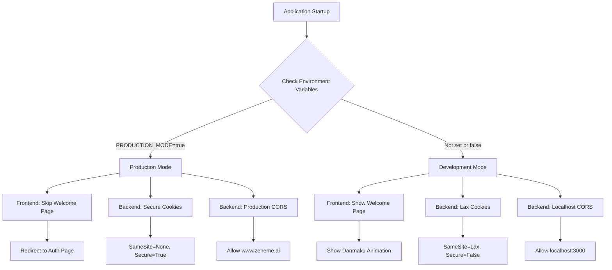

# Design Document: Production Deployment Configuration

## Overview

This design document outlines the technical approach for configuring the Zeneme AI application for production deployment. The solution implements environment-aware configuration that automatically adapts behavior based on deployment context (production vs development).

The design focuses on three key areas:
1. **Environment Detection**: Automatic detection of production vs development environments
2. **Frontend Configuration**: Root page routing and API URL configuration
3. **Backend Configuration**: CORS origins and cookie security settings

The implementation uses environment variables to control behavior, ensuring zero code changes are needed when deploying to different environments. All configuration is externalized to .env files, following the twelve-factor app methodology.

## Architecture

### High-Level Architecture

```
┌─────────────────────────────────────────────────────────────┐
│                     Production Environment                   │
│                        (www.zeneme.ai)                       │
├─────────────────────────────────────────────────────────────┤
│                                                               │
│  ┌──────────────────┐              ┌──────────────────┐    │
│  │   Next.js        │   HTTPS      │   FastAPI        │    │
│  │   Frontend       │◄────────────►│   Backend        │    │
│  │                  │   Cookies    │                  │    │
│  │  - Prod routing  │   (Secure,   │  - CORS config   │    │
│  │  - API URL       │   SameSite=  │  - Cookie config │    │
│  │    config        │   None)      │  - Auth routes   │    │
│  └──────────────────┘              └──────────────────┘    │
│         ▲                                    ▲               │
│         │                                    │               │
│         │ .env.local                         │ .env          │
│         │ (NEXT_PUBLIC_*)                    │ (Backend)     │
│         │                                    │               │
└─────────────────────────────────────────────────────────────┘

┌─────────────────────────────────────────────────────────────┐
│                  Development Environment                     │
│                      (localhost)                             │
├─────────────────────────────────────────────────────────────┤
│                                                               │
│  ┌──────────────────┐              ┌──────────────────┐    │
│  │   Next.js        │   HTTP       │   FastAPI        │    │
│  │   Frontend       │◄────────────►│   Backend        │    │
│  │   :3000          │   Cookies    │   :8000          │    │
│  │                  │   (SameSite= │                  │    │
│  │  - Dev routing   │   Lax)       │  - CORS config   │    │
│  │  - Welcome page  │              │  - Cookie config │    │
│  └──────────────────┘              └──────────────────┘    │
│                                                               │
└─────────────────────────────────────────────────────────────┘
```

### Configuration Flow



## Components and Interfaces

### 1. Environment Detection Module

**Purpose**: Centralize environment detection logic for consistent behavior across the application.

**Location**:
- Frontend: `zeneme-next/src/lib/environment.ts`
- Backend: `ai-chat-api/src/config/environment.py`

**Frontend Interface**:
```typescript
// zeneme-next/src/lib/environment.ts

export interface EnvironmentConfig {
  isProduction: boolean;
  apiUrl: string;
  frontendUrl: string;
}

/**
 * Detect if running in production environment
 * Checks NEXT_PUBLIC_PRODUCTION_MODE environment variable
 */
export function isProduction(): boolean {
  return process.env.NEXT_PUBLIC_PRODUCTION_MODE === 'true';
}

/**
 * Get API base URL based on environment
 * Falls back to localhost:8000 if not configured
 */
export function getApiUrl(): string {
  return process.env.NEXT_PUBLIC_API_URL || 'http://localhost:8000';
}

/**
 * Get frontend URL based on environment
 */
export function getFrontendUrl(): string {
  return process.env.NEXT_PUBLIC_FRONTEND_URL || 'http://localhost:3000';
}

/**
 * Get complete environment configuration
 */
export function getEnvironmentConfig(): EnvironmentConfig {
  return {
    isProduction: isProduction(),
    apiUrl: getApiUrl(),
    frontendUrl: getFrontendUrl(),
  };
}
```

**Backend Interface**:
```python
# ai-chat-api/src/config/environment.py

from typing import Dict, Any
import os

def is_production() -> bool:
    """
    Detect if running in production environment.
    Checks PRODUCTION_MODE environment variable.
    """
    return os.getenv("PRODUCTION_MODE", "false").lower() == "true"

def get_cookie_config() -> Dict[str, Any]:
    """
    Get cookie configuration based on environment.

    Production:
        - SameSite: None (allow cross-site)
        - Secure: True (HTTPS only)

    Development:
        - SameSite: Lax (default browser behavior)
        - Secure: False (allow HTTP)
    """
    if is_production():
        return {
            "samesite": "none",
            "secure": True,
            "httponly": True,
        }
    else:
        return {
            "samesite": "lax",
            "secure": False,
            "httponly": True,
        }

def get_cors_origins() -> list:
    """
    Get CORS origins from environment variable.
    Parses comma-separated list from CORS_ORIGINS.
    """
    origins_str = os.getenv("CORS_ORIGINS", "http://localhost:3000,http://localhost:8080,null")
    return [origin.strip() for origin in origins_str.split(",")]

def log_environment_config():
    """
    Log environment configuration on startup for debugging.
    """
    import logging
    logger = logging.getLogger(__name__)

    mode = "PRODUCTION" if is_production() else "DEVELOPMENT"
    cookie_config = get_cookie_config()
    cors_origins = get_cors_origins()

    logger.info(f"=" * 60)
    logger.info(f"Environment Mode: {mode}")
    logger.info(f"Cookie Configuration:")
    logger.info(f"  - SameSite: {cookie_config['samesite']}")
    logger.info(f"  - Secure: {cookie_config['secure']}")
    logger.info(f"  - HttpOnly: {cookie_config['httponly']}")
    logger.info(f"CORS Origins: {cors_origins}")
    logger.info(f"=" * 60)
```

### 2. Frontend Root Page Component

**Purpose**: Implement environment-aware routing for the root page.

**Location**: `zeneme-next/src/app/page.tsx`

**Modification Strategy**:
The existing `HomeContent` component already has the auth flow logic. We need to modify the section that handles `status === 'idle'` to check the environment:

```typescript
// In HomeContent component, modify the auth flow section:

import { isProduction } from '@/lib/environment';

// ... existing code ...

// Auth Flow: Show Welcome/Auth pages if status is 'idle'
if (status === 'idle') {
  // In production, skip welcome page and go directly to auth
  if (isProduction()) {
    return (
      <div className="flex h-screen w-full bg-transparent font-sans text-slate-200 overflow-hidden relative">
        <AuthPage onBack={() => {
          // In production, there's no "back" - just reload to auth page
          window.location.reload();
        }} />
      </div>
    );
  }

  // In development, show welcome page with option to navigate to auth
  return (
    <div className="flex h-screen w-full bg-transparent font-sans text-slate-200 overflow-hidden relative">
      {isAuthPageOpen ? (
        <AuthPage onBack={() => setIsAuthPageOpen(false)} />
      ) : (
        <WelcomePage onNavigateAuth={() => setIsAuthPageOpen(true)} />
      )}
    </div>
  );
}
```

### 3. Frontend API Client Configuration

**Purpose**: Configure API client to use environment-specific base URL.

**Location**: `zeneme-next/src/lib/api.ts`

**Current Implementation Analysis**:
The existing `api.ts` file likely has hardcoded API URLs or uses a constant. We need to update it to use the environment configuration.

**Modification Strategy**:
```typescript
// zeneme-next/src/lib/api.ts

import { getApiUrl } from './environment';

// Get API base URL from environment
const API_BASE_URL = getApiUrl();

// Update all API functions to use API_BASE_URL
export async function sendChatMessage(data: {
  message: string;
  session_id?: string;
  user_id?: string;
  images?: string[];
}) {
  const response = await fetch(`${API_BASE_URL}/chat/`, {
    method: 'POST',
    headers: {
      'Content-Type': 'application/json',
    },
    credentials: 'include', // Important for cookies
    body: JSON.stringify(data),
  });

  if (!response.ok) {
    throw new Error(`API request failed: ${response.statusText}`);
  }

  return response.json();
}

// Apply same pattern to all other API functions...
```

### 4. Backend Cookie Configuration

**Purpose**: Apply environment-specific cookie settings to authentication routes.

**Location**: `ai-chat-api/src/api/auth_routes.py`

**Modification Strategy**:
The auth routes file needs to import and use the cookie configuration from the environment module. We need to update all cookie-setting operations to use the dynamic configuration.

**Example Pattern**:
```python
# ai-chat-api/src/api/auth_routes.py

from src.config.environment import get_cookie_config

# In route handlers that set cookies:
@router.post("/auth/login")
async def login(response: Response, ...):
    # ... authentication logic ...

    # Get environment-specific cookie config
    cookie_config = get_cookie_config()

    # Set session cookie with environment-specific settings
    response.set_cookie(
        key="session_token",
        value=session_token,
        max_age=3600 * 24 * 7,  # 7 days
        **cookie_config  # Unpack environment-specific settings
    )

    return {"status": "success"}
```

### 5. Backend CORS Configuration

**Purpose**: Configure CORS middleware with environment-specific origins.

**Location**: `ai-chat-api/src/api/app.py`

**Current Implementation**:
```python
# Current implementation (lines 36-42)
app.add_middleware(
    CORSMiddleware,
    allow_origins=CORS_ORIGINS,
    allow_credentials=True,
    allow_methods=["*"],
    allow_headers=["*"],
)
```

**Modification Strategy**:
The current implementation already uses `CORS_ORIGINS` from settings. We just need to ensure the environment variable is properly configured. However, we should add logging:

```python
# ai-chat-api/src/api/app.py

from src.config.environment import get_cors_origins, log_environment_config

# Get CORS origins from environment
cors_origins = get_cors_origins()

# CORS middleware
app.add_middleware(
    CORSMiddleware,
    allow_origins=cors_origins,
    allow_credentials=True,
    allow_methods=["*"],
    allow_headers=["*"],
)

@app.on_event("startup")
async def startup_event():
    """Initialize database and log configuration on application startup"""
    logger.info("Starting up AI Chat API...")

    # Log environment configuration
    log_environment_config()

    # ... existing database initialization code ...
```

## Data Models

### Environment Configuration Schema

**Frontend Environment Variables** (`.env.local`):
```bash
# Production mode flag
NEXT_PUBLIC_PRODUCTION_MODE=true

# API base URL
NEXT_PUBLIC_API_URL=https://api.zeneme.ai

# Frontend URL (for OAuth callbacks, etc.)
NEXT_PUBLIC_FRONTEND_URL=https://www.zeneme.ai
```

**Backend Environment Variables** (`.env`):
```bash
# Production mode flag
PRODUCTION_MODE=true

# CORS origins (comma-separated)
# For production, use HTTPS domains only
# Option 1: Specific domains (recommended for security)
CORS_ORIGINS=https://www.zeneme.ai,https://zeneme.ai

# Option 2: Allow all subdomains (if you have api.zeneme.ai, admin.zeneme.ai, etc.)
# Note: FastAPI doesn't support wildcard patterns like "https://*.zeneme.ai"
# You must list each subdomain explicitly:
# CORS_ORIGINS=https://www.zeneme.ai,https://zeneme.ai,https://api.zeneme.ai

# Existing variables remain unchanged
OPENAI_API_KEY=sk-...
DATABASE_URL=postgresql://...
# ... other existing variables ...
```

### Cookie Configuration Model

```python
# Type definition for cookie configuration
from typing import TypedDict, Literal

class CookieConfig(TypedDict):
    samesite: Literal["none", "lax", "strict"]
    secure: bool
    httponly: bool
```

### Environment Configuration Model

```typescript
// Frontend environment configuration type
interface EnvironmentConfig {
  isProduction: boolean;
  apiUrl: string;
  frontendUrl: string;
}
```

## Correctness Properties

*A property is a characteristic or behavior that should hold true across all valid executions of a system—essentially, a formal statement about what the system should do. Properties serve as the bridge between human-readable specifications and machine-verifiable correctness guarantees.*


### Property 1: Environment Detection Parsing

*For any* environment variable value (including empty, "true", "false", "TRUE", "False", etc.), the environment detection functions SHALL correctly parse the value and return a boolean indicating production mode, where only the exact string "true" (case-insensitive) indicates production mode.

**Validates: Requirements 1.1, 1.2**

### Property 2: Default Development Mode

*For any* system configuration where production mode environment variables are not set or set to values other than "true", the system SHALL default to development mode behavior with development-specific configurations (Lax cookies, localhost CORS, welcome page display).

**Validates: Requirements 1.5**

### Property 3: Cookie Configuration Consistency

*For any* authentication-related cookie-setting operation, the cookie configuration SHALL use the environment-specific settings returned by the cookie configuration function, ensuring consistent SameSite and Secure attributes across all cookies.

**Validates: Requirements 4.5**

### Property 4: CORS Origins Parsing

*For any* comma-separated string of origins in the CORS_ORIGINS environment variable, the CORS configuration function SHALL correctly parse and return a list of individual origin strings with whitespace trimmed.

**Validates: Requirements 3.1**

### Property 5: API URL Configuration Reading

*For any* value of NEXT_PUBLIC_API_URL environment variable (including unset), the API URL configuration function SHALL return either the configured value or the default "http://localhost:8000" when unset.

**Validates: Requirements 5.1**

### Property 6: Authenticated User Routing Independence

*For any* environment mode (production or development), when the authentication status is 'authenticated', the frontend SHALL display the main application interface, demonstrating that authentication status takes precedence over environment-specific routing.

**Validates: Requirements 2.3**

### Example Test 1: Production Mode Configuration

When PRODUCTION_MODE="true" and NEXT_PUBLIC_PRODUCTION_MODE="true", the system SHALL apply production-specific configurations:
- Backend cookie config: SameSite="none", Secure=True
- Frontend routing: Direct to AuthPage for idle users
- API URL: Use configured production URL

**Validates: Requirements 1.3, 1.4**

### Example Test 2: Production Root Page Routing

When a user visits the root page ("/") in production mode (NEXT_PUBLIC_PRODUCTION_MODE="true") AND authentication status is 'idle', the frontend SHALL render the AuthPage component.

**Validates: Requirements 2.1**

### Example Test 3: Development Root Page Routing

When a user visits the root page ("/") in development mode (NEXT_PUBLIC_PRODUCTION_MODE not set or "false") AND authentication status is 'idle', the frontend SHALL render the WelcomePage component.

**Validates: Requirements 2.2**

### Example Test 4: Production CORS Origins

When PRODUCTION_MODE="true" and CORS_ORIGINS="https://www.zeneme.ai", the backend CORS configuration SHALL include "https://www.zeneme.ai" in the allowed origins list.

**Validates: Requirements 3.2**

### Example Test 5: Development CORS Origins

When PRODUCTION_MODE is not set or "false" and CORS_ORIGINS="http://localhost:3000,http://localhost:8080", the backend CORS configuration SHALL include both "http://localhost:3000" and "http://localhost:8080" in the allowed origins list.

**Validates: Requirements 3.3**

### Example Test 6: Production Cookie Configuration

When PRODUCTION_MODE="true", the cookie configuration function SHALL return:
- samesite: "none"
- secure: True
- httponly: True

**Validates: Requirements 4.1, 4.2**

### Example Test 7: Development Cookie Configuration

When PRODUCTION_MODE is not set or "false", the cookie configuration function SHALL return:
- samesite: "lax"
- secure: False
- httponly: True

**Validates: Requirements 4.3, 4.4**

### Example Test 8: API URL Default Value

When NEXT_PUBLIC_API_URL environment variable is not set, the API URL configuration function SHALL return "http://localhost:8000".

**Validates: Requirements 5.2**

### Example Test 9: Production API URL Configuration

When NEXT_PUBLIC_PRODUCTION_MODE="true" and NEXT_PUBLIC_API_URL="https://api.zeneme.ai", the frontend SHALL use "https://api.zeneme.ai" as the base URL for all API requests.

**Validates: Requirements 5.3**

### Example Test 10: Startup Logging

When the backend starts up, it SHALL log:
- Environment mode (PRODUCTION or DEVELOPMENT)
- Cookie configuration (SameSite, Secure, HttpOnly values)
- CORS origins list

**Validates: Requirements 7.1, 7.2**

## Error Handling

### Environment Variable Parsing Errors

**Scenario**: Invalid or malformed environment variable values

**Handling**:
- Environment detection functions use case-insensitive comparison
- Any value other than "true" is treated as false (development mode)
- Empty strings, null, undefined all default to development mode
- No exceptions thrown - always returns a valid boolean

**Example**:
```python
# Backend
def is_production() -> bool:
    value = os.getenv("PRODUCTION_MODE", "false")
    return value.lower() == "true"  # Safe for any string value
```

```typescript
// Frontend
export function isProduction(): boolean {
  const value = process.env.NEXT_PUBLIC_PRODUCTION_MODE;
  return value?.toLowerCase() === 'true';  // Safe for undefined/null
}
```

### Missing Environment Variables

**Scenario**: Required environment variables are not set

**Handling**:
- All environment variables have sensible defaults
- CORS_ORIGINS defaults to localhost values
- API_URL defaults to localhost:8000
- Production mode defaults to false (development)
- System remains functional with default configuration

**Logging**:
```python
logger.info("PRODUCTION_MODE not set, defaulting to development mode")
logger.info(f"Using default CORS origins: {default_origins}")
```

### CORS Configuration Errors

**Scenario**: CORS_ORIGINS contains invalid URLs or formatting

**Handling**:
- Parse comma-separated list with error tolerance
- Strip whitespace from each origin
- Empty strings are filtered out
- Invalid URLs are logged but not rejected (browser will handle)

**Example**:
```python
def get_cors_origins() -> list:
    origins_str = os.getenv("CORS_ORIGINS", "http://localhost:3000")
    origins = [origin.strip() for origin in origins_str.split(",")]
    # Filter out empty strings
    origins = [o for o in origins if o]

    if not origins:
        logger.warning("No valid CORS origins found, using default")
        return ["http://localhost:3000"]

    return origins
```

### Cookie Configuration Errors

**Scenario**: Cookie settings incompatible with environment (e.g., Secure=True on HTTP)

**Handling**:
- Configuration is environment-aware by design
- Development mode never sets Secure=True
- Production mode always sets Secure=True (assumes HTTPS)
- If production is accessed via HTTP, cookies will fail (expected behavior)

**Validation**:
```python
def get_cookie_config() -> Dict[str, Any]:
    config = {
        "samesite": "none" if is_production() else "lax",
        "secure": is_production(),
        "httponly": True,
    }

    # Log warning if production mode but no HTTPS
    if is_production():
        logger.warning(
            "Production mode enabled - cookies require HTTPS. "
            "Ensure application is served over HTTPS."
        )

    return config
```

### Frontend Routing Errors

**Scenario**: User navigates to root page but auth state is unknown

**Handling**:
- Auth state defaults to 'idle' if unknown
- Idle state triggers appropriate page based on environment
- No error thrown - graceful fallback to auth/welcome page

**Example**:
```typescript
// Safe fallback for unknown auth state
const authStatus = status || 'idle';

if (authStatus === 'idle') {
  if (isProduction()) {
    return <AuthPage />;
  }
  return <WelcomePage />;
}
```

### API URL Configuration Errors

**Scenario**: API URL is malformed or unreachable

**Handling**:
- Configuration only validates format, not reachability
- Network errors are handled by API client layer
- Invalid URLs will cause fetch errors (caught by try/catch)
- Error messages include the configured API URL for debugging

**Example**:
```typescript
export async function sendChatMessage(data: any) {
  const apiUrl = getApiUrl();

  try {
    const response = await fetch(`${apiUrl}/chat/`, {
      method: 'POST',
      credentials: 'include',
      headers: { 'Content-Type': 'application/json' },
      body: JSON.stringify(data),
    });

    if (!response.ok) {
      throw new Error(`API request failed: ${response.statusText}`);
    }

    return response.json();
  } catch (error) {
    console.error(`Failed to connect to API at ${apiUrl}:`, error);
    throw new Error(
      `Unable to reach API server at ${apiUrl}. ` +
      `Please check your network connection and API configuration.`
    );
  }
}
```

## Testing Strategy

### Dual Testing Approach

This feature requires both unit tests and property-based tests to ensure comprehensive coverage:

**Unit Tests**: Focus on specific examples and edge cases
- Specific environment variable values ("true", "false", "", undefined)
- Specific routing scenarios (production idle, development idle, authenticated)
- Specific configuration outputs (production cookies, development cookies)
- Startup logging output verification

**Property-Based Tests**: Verify universal properties across all inputs
- Environment detection works for any string input
- Cookie configuration consistency across all cookie operations
- CORS parsing works for any comma-separated string
- API URL configuration handles any input value

### Testing Framework Selection

**Frontend Testing**:
- Framework: Jest + React Testing Library
- Property-based testing: fast-check
- Minimum 100 iterations per property test

**Backend Testing**:
- Framework: pytest
- Property-based testing: Hypothesis
- Minimum 100 iterations per property test

### Test Organization

**Frontend Tests**:
```
zeneme-next/src/lib/__tests__/
├── environment.test.ts          # Unit tests for environment detection
├── environment.properties.test.ts  # Property-based tests
└── api.test.ts                  # API client configuration tests

zeneme-next/src/app/__tests__/
└── page.test.tsx                # Root page routing tests
```

**Backend Tests**:
```
ai-chat-api/tests/
├── test_environment.py          # Unit tests for environment module
├── test_environment_properties.py  # Property-based tests
├── test_cookie_config.py        # Cookie configuration tests
└── test_cors_config.py          # CORS configuration tests
```

### Property Test Configuration

Each property test must:
1. Run minimum 100 iterations
2. Reference the design document property number
3. Use appropriate generators for input values
4. Include tag comment with feature name and property

**Example Tag Format**:
```python
# Feature: production-deployment-config, Property 1: Environment Detection Parsing
def test_environment_detection_parsing(value):
    # Test implementation
    pass
```

### Unit Test Coverage Requirements

**Environment Detection**:
- Test "true" returns True
- Test "TRUE" returns True (case insensitive)
- Test "false" returns False
- Test "" returns False
- Test undefined/None returns False
- Test "random" returns False

**Cookie Configuration**:
- Test production mode returns correct config
- Test development mode returns correct config
- Test config includes all required fields
- Test httponly is always True

**CORS Configuration**:
- Test single origin parsing
- Test multiple origins parsing
- Test whitespace handling
- Test empty string handling
- Test default value when not set

**Frontend Routing**:
- Test production + idle shows AuthPage
- Test development + idle shows WelcomePage
- Test production + authenticated shows main app
- Test development + authenticated shows main app

**API URL Configuration**:
- Test configured value is returned
- Test default value when not set
- Test API client uses configured URL

**Startup Logging**:
- Test production mode logs correct values
- Test development mode logs correct values
- Test log format includes all required information

### Integration Testing

**End-to-End Scenarios**:
1. Deploy to production environment, verify:
   - Root page redirects to auth
   - Cookies have Secure and SameSite=None
   - CORS allows production domain
   - API requests use production URL

2. Run in development environment, verify:
   - Root page shows welcome page
   - Cookies have SameSite=Lax and no Secure flag
   - CORS allows localhost
   - API requests use localhost URL

3. Test environment switching:
   - Change environment variables
   - Restart application
   - Verify configuration changes take effect

### Manual Testing Checklist

**Production Deployment**:
- [ ] Set environment variables on EC2
- [ ] Restart both frontend and backend
- [ ] Visit www.zeneme.ai - should see auth page
- [ ] Check browser DevTools - cookies should have Secure and SameSite=None
- [ ] Check browser DevTools Network tab - API requests should go to production URL
- [ ] Test login flow - cookies should persist
- [ ] Check backend logs - should show PRODUCTION mode

**Development Environment**:
- [ ] Unset production environment variables
- [ ] Restart both frontend and backend
- [ ] Visit localhost:3000 - should see welcome page
- [ ] Check browser DevTools - cookies should have SameSite=Lax
- [ ] Check browser DevTools Network tab - API requests should go to localhost:8000
- [ ] Test login flow - cookies should persist
- [ ] Check backend logs - should show DEVELOPMENT mode
